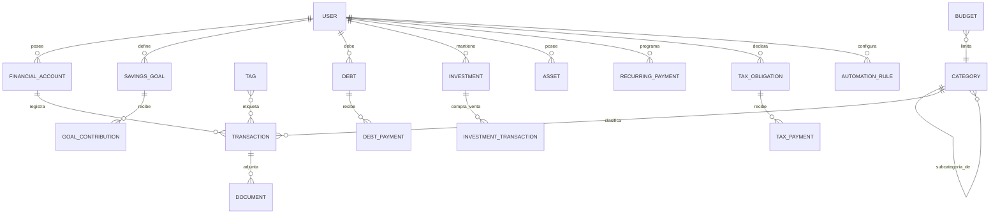

# Modelo de Dominio y Convenciones

Convenciones que aplican a **todo** modelo Prisma y entidad de dominio nuevos del dominio
financiero (ver la lista completa de módulos en
[03 — Arquitectura](./03-arquitectura.md)). Se basan en lo que ya existe en `schema.prisma` (ver
`apps/api/docs/06-database.md`) para no introducir un segundo estilo dentro del mismo proyecto.

## Convenciones de esquema (Prisma)

Todo modelo financiero sigue el mismo esqueleto que `User`, `Role`, etc.:

```prisma
model FinancialAccount {
  id         String    @id @default(uuid())
  user_id    String
  // ...campos propios del modelo...
  created_at DateTime  @default(now())
  updated_at DateTime? @updatedAt
  deleted_at DateTime?
  status     Status    @default(ACTIVE)

  user User @relation(fields: [user_id], references: [id], onDelete: Cascade)

  @@map("financial_accounts")
}
```

Reglas fijas: `id` es `uuid()`; nombres de campo en `snake_case`; toda tabla tiene `@@map` a
`snake_case` plural; borrado lógico con `deleted_at` + `status = DELETED` (nunca `DELETE` real,
salvo tablas de unión que sí pueden usar `onDelete: Cascade`); reutilizar el enum `Status` existente
(`ACTIVE | INACTIVE | SUSPENDED | PENDING | DELETED`) cuando el ciclo de vida del modelo encaje —
si no encaja (ver más abajo), se define un enum propio en vez de forzar `Status`.

## Dinero: tipo de dato y precisión

**Nunca `Float`/`number` para montos.** En Prisma, todo campo monetario es:

```prisma
amount   Decimal @db.Decimal(18, 4)
```

18 dígitos totales, 4 decimales — suficiente para lempiras, dólares, euros y para criptomonedas con
más precisión si se necesita ajustar puntualmente por activo. En TypeScript, `@prisma/client` expone
estos campos como `Prisma.Decimal` (no `number`): las operaciones aritméticas se hacen con los
métodos de `Decimal` (`.plus()`, `.minus()`, `.mul()`, `.div()`), nunca convirtiendo a `number` en
medio de un cálculo (solo al final, para mostrar en UI).

En el frontend, cualquier cálculo (progreso de meta, simulador de pagos, totales de presupuesto) usa
una librería de precisión decimal (ej. `decimal.js`, mismo concepto que usa Prisma) en vez de
aritmética nativa de JavaScript. Se agrega como dependencia nueva de `apps/web` cuando el primer
módulo que calcule dinero en el cliente lo necesite (el simulador de deudas, ver
[06 — Deudas](./modules/06-deudas.md), es el primer candidato).

## Moneda

Cada `FinancialAccount` y cada `Transaction` guardan su propia moneda:

```prisma
currency_code String @db.Char(3)  // ISO 4217, ej. "HNL", "USD", "EUR"
```

No se resuelve el tipo de cambio "al vuelo" en cada consulta. Para reportes/dashboard que agregan
montos en distintas monedas, se usa el modelo `ExchangeRate` (ver
[12 — Importación, exportación y monedas](./modules/12-importacion-exportacion-monedas.md)) y se
convierte explícitamente a una moneda base configurable por el usuario.

`UserPreferences` (ya existe) es el lugar natural para guardar esa moneda base — se le agrega un
campo `base_currency` en la migración que introduzca el primer módulo financiero que lo necesite
(dashboard/reportes), no antes.

## Pertenencia y alcance (`user_id`)

Todo modelo financiero tiene `user_id` obligatorio y toda query de lectura/escritura en el
repositorio recibe el `user_id` del usuario autenticado (nunca se confía en un `user_id` que venga
en el body/query del request para decidir de quién son los datos — ese siempre sale del JWT vía
`@CurrentUser()`).

**Nota sobre el rol "Familia" del documento de requisitos original:** hoy no existe ningún modelo de
"hogar" o "espacio compartido" — el RBAC actual (`Role`, `Permission`, `UserRole`) controla *qué
puede hacer* un usuario dentro de la aplicación, no *con quién comparte datos*. Compartir cuentas
entre miembros de una familia es una decisión de modelado pendiente (probablemente un modelo
`Household` con una tabla de miembros, y cambiar el alcance de "un `user_id` dueño" a "uno o más
`user_id` con acceso"). Se documenta aquí como decisión abierta explícita — no se debe intentar
resolver improvisando un `family_id` suelto en un modelo aislado cuando llegue el momento.

## Enums nuevos por módulo

En vez de forzar el enum `Status` genérico a todo, cada módulo define los enums que reflejan su
propio ciclo de vida. Ejemplos que ya se anticipan (detalle en cada doc de módulo):

- `AccountType` (`BANK`, `CASH`, `CREDIT_CARD`, `INVESTMENT`, `SAVINGS`, `CRYPTO`, `LOAN`)
- `TransactionType` (`INCOME`, `EXPENSE`, `TRANSFER`, `ADJUSTMENT`)
- `RecurrenceFrequency` (`WEEKLY`, `MONTHLY`, `QUARTERLY`, `YEARLY`)
- `DebtType` (`MORTGAGE`, `LOAN`, `CREDIT_CARD`, `FINANCING`, `PERSONAL_LOAN`)
- `InterestType` (`FIXED`, `VARIABLE`)
- `InvestmentType` (`STOCK`, `ETF`, `FUND`, `BOND`, `CRYPTO`, `REAL_ESTATE`)
- `AssetType` (`REAL_ESTATE`, `VEHICLE`, `ELECTRONICS`, `BUSINESS`, `EQUIPMENT`, `OTHER`)
- `TaxType` (`INCOME_TAX`, `MUNICIPAL`, `VAT`, `CAPITAL_GAINS`, `OTHER`)
- `GoalStatus` (`IN_PROGRESS`, `ACHIEVED`, `ABANDONED`)

`Status` (el enum genérico existente) se sigue usando únicamente para el campo de "activo/inactivo/
eliminado" que casi todo modelo tiene además de su enum de dominio propio — no lo reemplaza.

## Diagrama de entidades (visión general)



Este diagrama es intencionalmente de alto nivel — cada módulo en `docs/modules/` detalla los campos
exactos de sus propias entidades.
